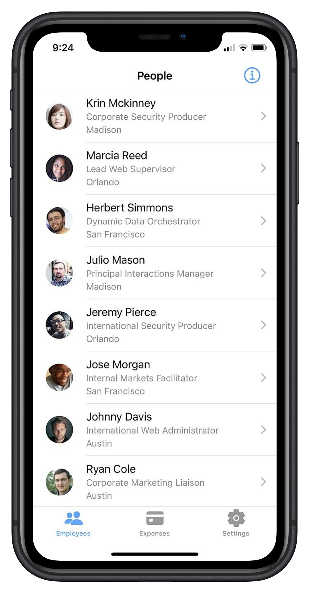

Ionifits is a Zenefits-inspired human resources demo app. It's a showcase of Ionic App Platform technologies, including [Ionic Framework](https://ionicframework.com), [Capacitor](https://capacitorjs.com), and [Ionic Native Enterprise solutions](https://ionicframework.com/docs/enterprise/solutions).

## Try the App

Ionifits runs on the web, iOS, and Android all from a single codebase. See for yourself:

- iOS: [Public TestFlight Link](https://testflight.apple.com/join/87WO2hwS)
- Android: [Public Beta link](https://play.google.com/store/apps/details?id=io.ionic.demoapp.ionifits)
- Web: [https://ionifits.ionicframework.com](https://ionifits.ionicframework.com)

An [8 minute overview video](https://ionicpro.wistia.com/medias/s8h3vpsxp8) of the app's key features is also available. See the app running on an iPhone alongside explanations of the real code in use.

## Features

**"Vanilla" Ionic Framework:** Show off the power and performance of Ionic UI components by using them as-is (out-of-the-box as much as possible).

**Auth Connect and Identity Vault-powered Login page:** Log into Ionifits using Auth0 (username: user@test.com, password: ionic). Optionally, tap the "Skip" button to bypass login. Log out from the Settings page. After login, the Auth0 user access token is securely stored in the mobile device keychain using Ionic Identity Vault. When the app is placed into the background, the screen is obscured to protect Ionifits data.

**Employee Management page:**  Display a list of all "employees", demonstrating high performance infinite scrolling containing hundreds of items. Tap on an employee to see their details (note the built-in Ionic Framework native-feeling animations).

**Expense Management page:** Complete expense management implementation (similar to how Abacus works), featuring full CRUD (create-read-update-delete) for expenses. Add a new expense's merchant name, cost, date, and more, and capture a photo of the receipt using your device's camera. Once saved, tap on the expense to make changes. Slide an expense item in the list of Completed Expenses to the left to delete it.

**Settings page:** Simple page showing off other Ionic Framework UI components.

**Implementation Details buttons:** Tap the "i" icon in the upper-right hand corner to view details about the technologies used, including Ionic Framework UI components and Ionic Native Enterprise features.

## Tech Details

- Native runtime: [Capacitor](https://capacitorjs.com)
- Framework: Ionic 5 (Angular 11)
- Capacitor Core plugins:
    - Camera, Filesystem, Storage
- Ionic Native Enterprise solutions: Auth Connect and Identity Vault

## How to Run
> Note: Installing and running this app requires a subscription to [Ionic Enterprise](https://ionicframework.com/enterprise). For details and a live demo, please reach out [here](https://ionicframework.com/enterprise/contact).

- Install the Ionic CLI: `npm install -g @ionic/cli`
- Clone this repository: `git clone https://github.com/ionic-team/ionifits.git`
- Navigate to repo in a terminal: `cd ionifits`
- Add an Ionic Enterprise Native key into your `.bash_profile` file or as an Environment Variable on Windows: `export ENT_NATIVE_KEY="key_4e9d5..."`
- Install dependencies (this will fail if you don't have an Ionic Native key): `npm i`
- Run locally in a browser: `ionic serve`
- Deploy to a mobile device: See details [here](https://capacitorjs.com/docs/basics/running-your-app).
